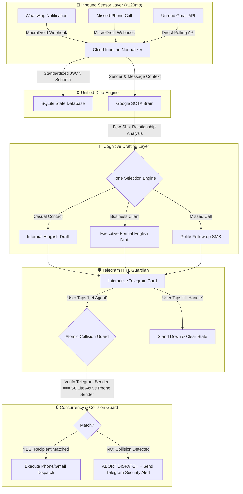

# 🛡️ OmniGate: Autonomous Omnichannel AI Gatekeeper & HITL Dispatcher

[](https://opensource.org/licenses/MIT)
[](https://www.python.org/)
[](https://n8n.io/)
[](https://ai.google.dev/)
[](https://core.telegram.org/bots)
[](https://render.com/)

> **An event-driven autonomous personal secretary that intercepts, normalizes, and contextually drafts intelligent responses for WhatsApp, Phone Calls, and Gmail in sub-120ms—featuring a zero-trust Human-In-The-Loop (HITL) approval system and an atomic SQLite state engine that completely eliminates cross-message collision risks.**

---

## 🌟 Architecture Overview



---

## 💡 Why OmniGate? (The Problem with Existing Bots)

Traditional auto-responders fail catastrophically in real-world scenarios:
1. **Robotic & Impersonal**: Generic *"I am currently busy, call later"* templates irritate clients and friends.
2. **Tone Deafness**: Inability to differentiate between an informal WhatsApp banter with a friend and a high-stakes client email.
3. **The Fatal Cross-Message Collision Risk**: If an automated system is waiting for approval to reply to *Contact A*, but *Contact B (Your Boss)* texts 10 seconds later, dumb automation blindly presses "Reply" on Android—sending Contact A's casual text directly to your Boss!

**OmniGate solves all three problems with 100% human oversight and atomic state verification.**

---

## ⚡ Key Features

* **🏎️ Sub-120ms Omnichannel Ingestion**: Ingests push notifications from WhatsApp and telephony via MacroDroid webhooks, and monitors Gmail through official REST APIs.
* **🎭 Dynamic Multi-Tone Adaptation (Google SOTA Models)**: Leverages few-shot prompt injection to synthesize responses matching the sender's exact register:
  * **Hinglish (Casual WhatsApp)**: *"haan bhai, pakka aa raha hu time pe"*
  * **Executive English (Client Email)**: *"Hi Alex, thanks for reaching out. The updated pitch deck is ready. Sharing link shortly."*
  * **Follow-up SMS (Missed Calls)**: Courteous single-sentence callback offers.
* **🛡️ Zero-Trust Human-In-The-Loop (HITL)**: Nothing is ever dispatched behind your back. Every proposed draft is presented as an interactive Telegram card with single-tap `[ Let Agent Handle ]` or `[ I'll Handle It ]` callbacks.
* **🔒 Atomic SQLite Collision Guard**: Cross-verifies the prompt recipient against the physical device's active top notification before every dispatch. If a mismatch is detected, dispatch is aborted instantly with an emergency Telegram alert.
* **☁️ 100% Free 24/7 Autonomy**: Deployed on Render Cloud's free tier with persistent webhook endpoints, operating continuously even when your primary workstation is powered off.

---

## 🚨 The Hard Engineering Challenge: Cross-Message Collision Guard

| Step | State | Action Taken |
| :---: | :--- | :--- |
| **T = 0s** | Aman messages on WhatsApp: *"Match chalna hai kya?"* | Ingested $\rightarrow$ Gemini drafts reply $\rightarrow$ Telegram card sent. SQLite records `active_contact = 'Aman'`. |
| **T = +15s** | Boss texts on WhatsApp: *"Need presentation slides urgently!"* | Phone notification stack updates. SQLite updates `active_contact = 'Boss'`. |
| **T = +25s** | User opens Telegram and taps **[Let Agent Handle]** on Aman's card. | **Collision Guard Triggers:** Evaluates `Card Target ('Aman') !== SQLite Active ('Boss')`. |
| **Result** | **Dispatch Instantly Aborted!** | Phone does **not** type. Security alert sent to Telegram. Zero professional damage! |

---

## 🛠️ Tech Stack & Tools

* **Core Engine**: Python 3.10+, FastAPI / Flask
* **Orchestration**: n8n (Visual Event-Driven Microservices Canvas)
* **LLM & Reasoning**: Google SOTA Models (Sub-second latency, multi-lingual Hinglish & English)
* **Mobile Ingestion**: MacroDroid On-Device Sensor Layer (Zero screen-wake notification extraction)
* **Governance**: Telegram Bot API (Inline Keyboards & Callback Queries)
* **Persistence & Concurrency**: SQLite (WAL Mode for atomic concurrency)
* **Cloud Infrastructure**: Render Cloud (24/7 Free Container Webhook Server)

---

## 📁 Repository Structure

```plaintext
├── workflows/
│   └── omnichannel_gatekeeper.json   # Full visual n8n workflow blueprint
├── scripts/
│   ├── engine.py                     # Multi-tone prompt engineering & Gemini client
│   ├── collision_guard.py            # SQLite state verification & safety abort logic
│   └── telegram_dispatcher.py        # Interactive Telegram HITL card callbacks
├── config/
│   └── .env.example                  # Environment variables template
├── simulation/
│   └── pipeline_simulation.html      # Interactive visual pipeline simulator
├── docs/
│   └── architecture_walkthrough.mp4  # 1080p Full HD video explainer
├── requirements.txt                  # Python dependencies
└── README.md                         # Project documentation
```

---

